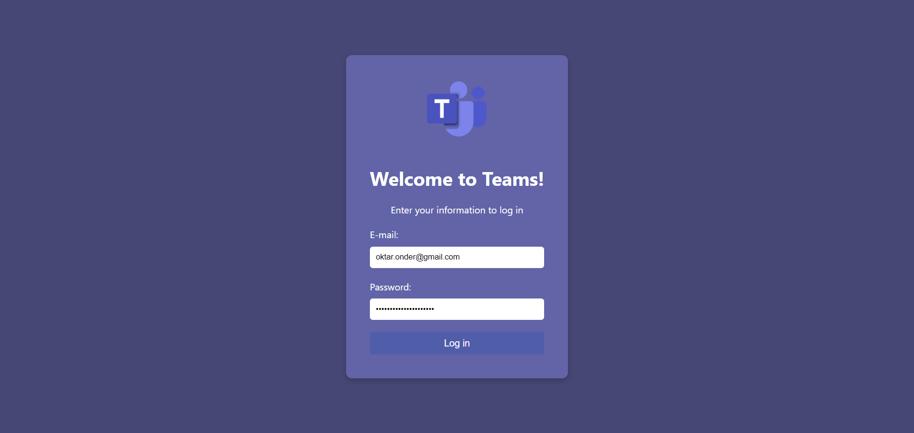
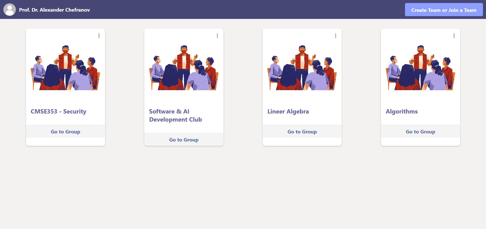
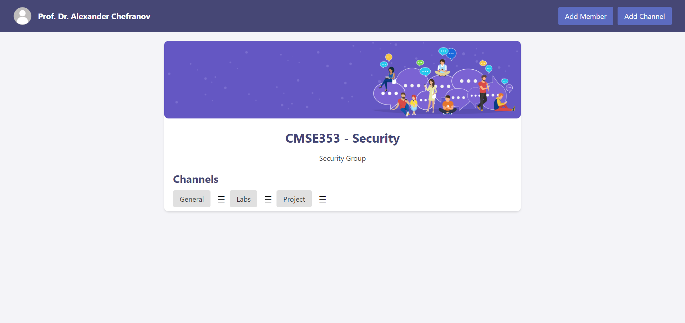
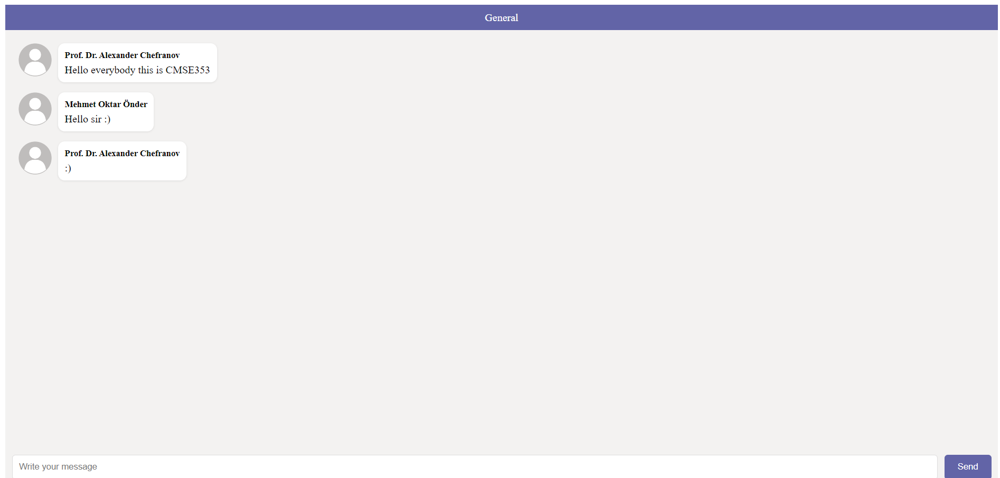
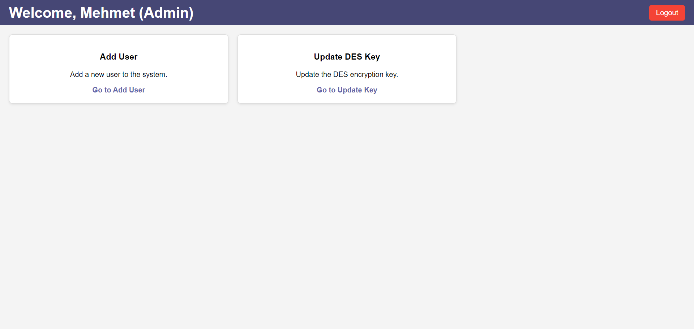

# Secure Teams-Like System (STLS)

 

## 📖 Description

Secure Teams-Like System (STLS) is an innovative communication platform tailored for educational environments. It emulates the functionality of Microsoft Teams, offering secure and efficient communication channels, enriched with DES encryption for enhanced privacy and security.

## 🌟 Features

- **Secure Messaging**: Ensuring privacy with DES encryption.
- **Role-Based Access Control**: Distinct functionalities for Students, Teachers, and System Administrators.
- **Real-Time Communication**: Create groups, participate in discussions, and share information in real-time.
- **Intuitive User Interface**: User-friendly design, resembling Microsoft Teams.

## 🚀 Installation

To get STLS up and running on your local machine, follow these steps:

1. **Clone the Repository**
   ```bash
   git clone https://github.com/oktaronder/SecureTeams-LikeSystem.git

2. **Navigate to the Project Directory**
   ```bash
   cd SecureTeamsEduHub
3. **Create and Activate a Virtual Environment**
   ```bash
   python -m venv venv
   source venv/bin/activate  # On Windows, use `venv\Scripts\activate`

4. **Install Dependencies**
   ```bash
   pip install -r requirements.txt

## Usage
1. **To start the STLS server:**
   ```bash
   python app.py

2. **Navigate to http://127.0.0.1:5000 in your web browser to access the application.**

## 📸 Screenshots

Here are key screenshots showcasing the main functionalities of the STLS platform:

### Login Page
 
_Where users including students, teachers, and admins can sign in._

### Teacher Dashboard

_Teachers can manage groups and create channels here._

### Group Interface

_The interface where teachers and students interact within a group._

### Chat Interface

_The real-time chat interface for communication within groups._

### Admin Dashboard

_Admin panel for managing user accounts and system settings._

## 🤝 Contributing

Your contributions are what makes the open-source community a fantastic place to innovate and collaborate. Whether it's fixing bugs, adding new features, or improving documentation, we welcome your contributions!

For more information on how to contribute, please refer to our [Contribution Guidelines](CONTRIBUTING.md).

## 📄 License

STLS is proudly open-sourced under the MIT License. For more details, please see the [LICENSE](LICENSE.md) file.


   
   
   

   
